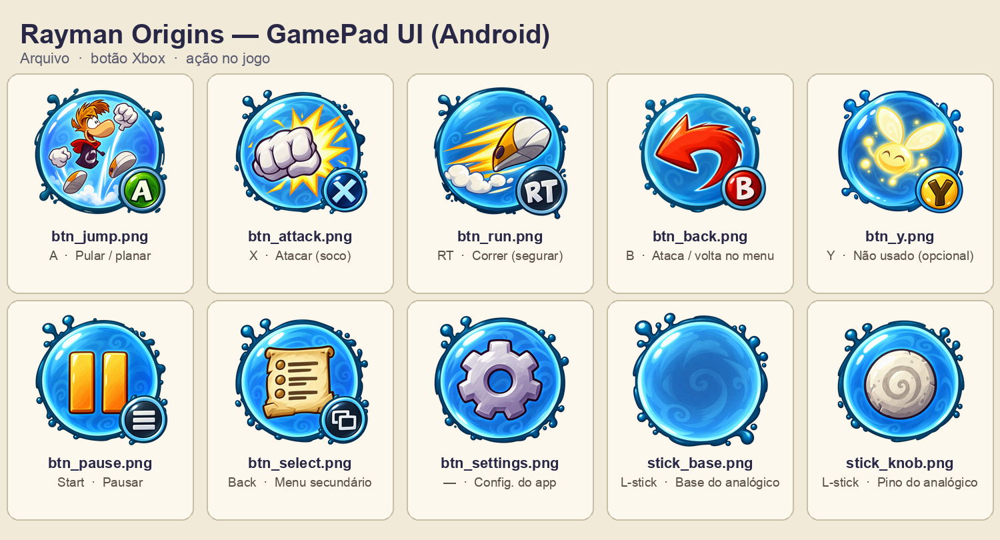

# GamePad UI: botões de toque temáticos

Arte dos botões na tela do port Android. Os nomes seguem [docs/TOUCH_BUTTONS.md](../docs/TOUCH_BUTTONS.md), que é o nome que o app procura.

| Arquivo | Botão Xbox | Ação no jogo | Nos menus | Desenho |
|---|---|---|---|---|
| `btn_jump.png` | A | **Pular** (segurar no ar = planar) | confirmar | Rayman saltando |
| `btn_attack.png` | X | **Atacar** (soco) | — | punho com impacto |
| `btn_run.png` | RT | **Correr** (segurar) | — | tênis com rastro de velocidade |
| `btn_back.png` | B | também ataca | **voltar** | seta curva de retorno |
| `btn_y.png` | Y | não usado | — | Lum (pode sair do layout) |
| `btn_pause.png` | Start | **pausar** | abrir o menu | ❚❚ |
| `btn_select.png` | Back | menu secundário | — | pergaminho com lista |
| `btn_settings.png` | — | configurações do app | — | engrenagem |
| `stick_base.png` | analógico esquerdo | **andar** | navegar | bolha vazia com espiral |
| `stick_knob.png` | analógico esquerdo | pino do analógico | — | pedra com espiral |

## Formato

- PNG RGBA, **1254×1254**, com fundo transparente. O app pede 512×512. A redução é feita na hora de copiar pra `android/app/src/main/res/drawable-nodpi/`.
- O desenho é redondo, mas os respingos de tinta passam um pouco do círculo. O toque é testado no círculo, então isso não atrapalha.
- **Ainda falta o estado pressionado** (`*_pressed.png`). Sem ele, o app clareia o botão normal. No concept, o pressionado tem um brilho amarelo em volta.
- O `stick_knob` já tem um anel de bolha em volta da pedra. Desenhado por cima do `stick_base`, fica bolha dentro de bolha. Se não ficar bom, basta recortar só a pedra.

## Mockup aprovado

[mockup/index.html](mockup/index.html) mostra os botões na tela do S23 (2340×1080), nas posições do `TouchControls.java`, com os estados normal, pressionado e oculto, e com opacidade e tamanho ajustáveis. Abra direto no navegador a partir do repositório. **Esse é o visual aprovado para aplicar no app.** O pressionado do mockup (8% menor, mais claro e com brilho amarelo) é o que o app deve gerar enquanto não houver `*_pressed.png`.
