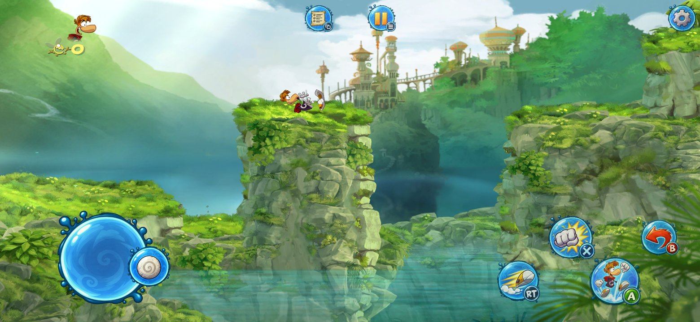
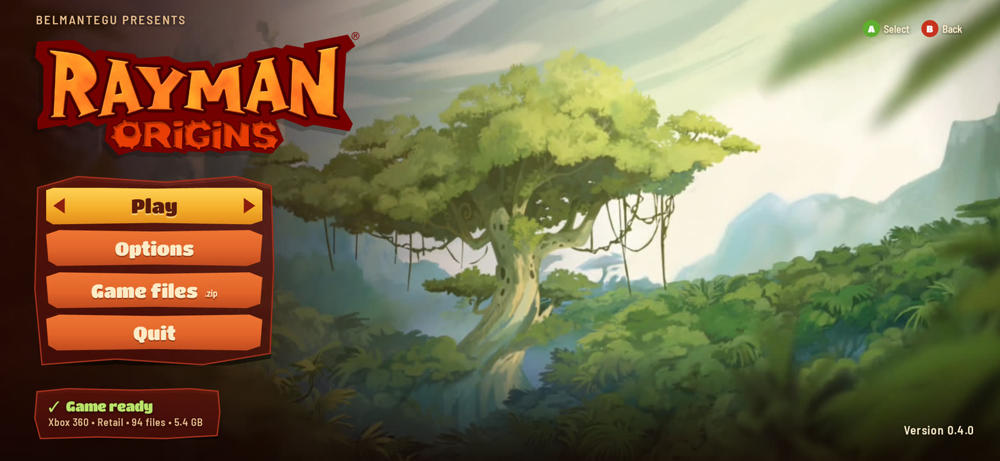
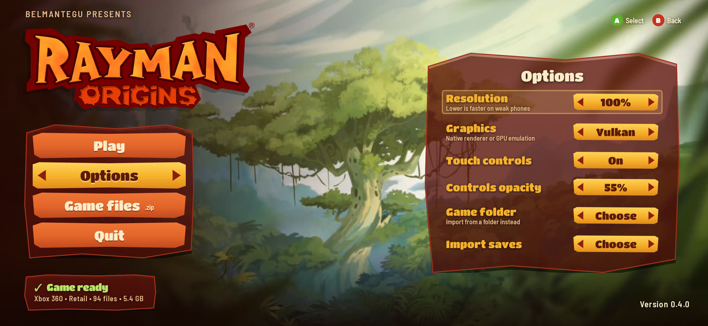
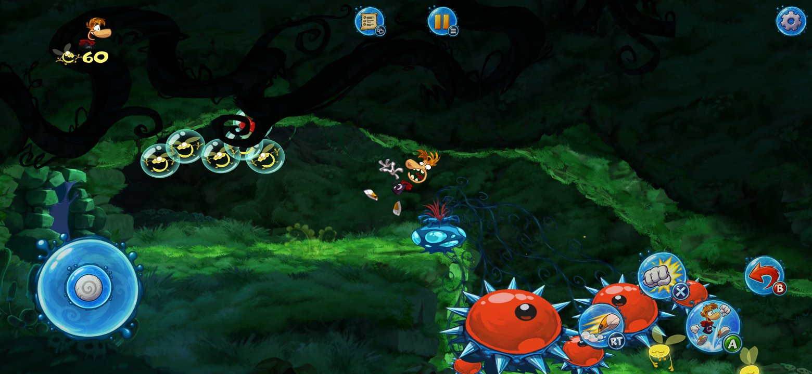
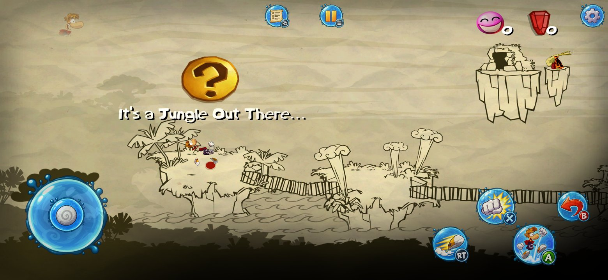
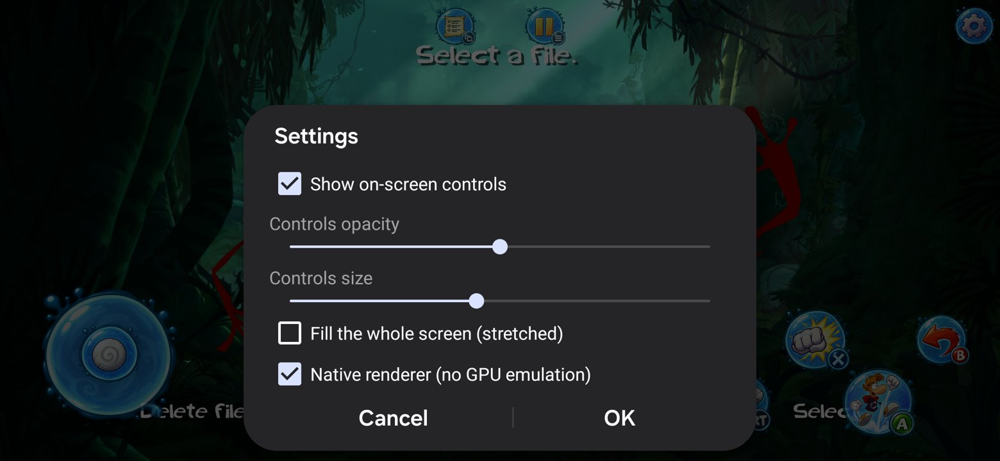

# Rayman Origins Recompiled

An unofficial effort to statically recompile the Xbox 360 version of **Rayman Origins** into native code, first for desktop (macOS/Linux/Windows) and then for **Android**, using [XenonRecomp](https://github.com/hedge-dev/XenonRecomp).

> [!IMPORTANT]
> **This repository contains no game code or assets.** You need your own legally obtained copy of Rayman Origins for Xbox 360. Everything derived from the game (the executable, the recompiled C++ and the game data) is generated or read locally from your own dump and must never be committed, uploaded or shared here.

<p align="center">
  
  <br>
  <em>Galaxy S23 (Android 16): native Vulkan renderer, true 19.5:9 widescreen, 60 fps, on-screen controller</em>
</p>

<table>
  <tr>
    <td align="center"><br><em>Home screen</em></td>
    <td align="center"><br><em>Options: render resolution, graphics, touch controls</em></td>
  </tr>
  <tr>
    <td align="center"><br><em>Gameplay</em></td>
    <td align="center"><br><em>World map</em></td>
  </tr>
  <tr>
    <td align="center"><br><em>Cutscene</em></td>
    <td align="center"><br><em>Settings: controls opacity/size, native renderer</em></td>
  </tr>
</table>

## Status

**The game runs on macOS (Apple Silicon) and on Android (Galaxy S23)** with graphics, audio, movies and controls. On Android there is an on-screen controller; physical controllers and keyboards work too. The game's code is recompiled to native ARM64. Graphics no longer go through Xbox 360 GPU emulation: a native renderer draws the game's frames straight to Vulkan with its own shaders, at 60 fps and in true widescreen (19.5:9 on the S23). See [docs/NATIVE_RENDERER.md](docs/NATIVE_RENDERER.md).

| Phase | Goal | Status |
|---|---|---|
| 1 | XenonRecomp translates the whole executable to C++ with no warnings | ✅ Done |
| 2 | The recompiled code and a minimal runtime compile and link | ✅ Done |
| 3 | Boot test: the game allocates memory, starts threads and opens its `.ipk` archives | ✅ Done |
| 4 | Graphics, audio, input | ✅ Via [ReXGlue](https://github.com/rexglue/rexglue-sdk) (Vulkan/MoltenVK), GPU emulated |
| 5 | Android (NDK, Vulkan, touch/gamepad) | ✅ Runs on a Galaxy S23: [docs/ANDROID.md](docs/ANDROID.md) |
| 6 | Native renderer (no GPU emulation) | ✅ Done: 60 fps on a Galaxy S23, true widescreen, movies. [docs/NATIVE_RENDERER.md](docs/NATIVE_RENDERER.md) |
| 7 | Performance and more phones | ✅ Levels at 60 fps at full resolution on the S23 (were 43–46), 60 fps on a Galaxy A56 (Exynos, Xclipse GPU), plain Vulkan 1.1 support. [docs/ANDROID_PERFORMANCE.md](docs/ANDROID_PERFORMANCE.md) |

## Roadmap

1. ~~**Native renderer.**~~ ✅ Done: the game's draws go straight to Vulkan, with shaders converted ahead of time by XenosRecomp.
2. ~~**True widescreen.**~~ ✅ Done: a 19.5:9 phone shows more of the level instead of stretching.
3. **Native renderer gaps.** Render-to-texture passes and vertex formats not seen yet.
4. ~~**Performance on phones.**~~ ✅ Done: profiled and fixed on the Galaxy S23, runs on Exynos (Galaxy A56), Vulkan 1.1 path for Adreno 6xx.
5. ~~**Home screen and game import.**~~ ✅ Done: a home screen in the game's own style ([docs/PORT_HOME.md](docs/PORT_HOME.md)) and one-file game pack import.
6. **Low-end phones.** Run on the Redmi 10C (Adreno 610, Vulkan 1.1); texture decoding off the game thread.

Technical write-up of every step, including the bugs found along the way: [docs/PROGRESS.md](docs/PROGRESS.md).

## How it works

1. **XenonRecomp** (our fork, as a submodule in `tools/XenonRecomp`) turns the PowerPC code of `default.xex` into C++ that runs on any 64-bit platform (x86-64 or ARM64 through SIMDe).
2. Things XenonRecomp can't detect by itself for this game are generated by our tools:
   - `tools/jumptables`: the stock XenonAnalyse finds 0 jump tables in Rayman Origins, because its compiler reorders instructions and inserts `nop`s. This detector simulates each switch block instead of matching fixed patterns and resolves all 173. It also emits explicit function boundaries for leaf functions that the analyzer would split (jump tables and `mtctr`/`bdz` switches).
   - `recomp/config/rayman.toml`: the recompiler config (register save/restore helpers, function boundaries).
3. `runtime/` is the host side: guest memory, the XEX loader and implementations of the Xbox 360 kernel/XAM imports. Imports that aren't implemented yet are weak stubs that just log.

## Building and playing (macOS, Apple Silicon)

Requirements: CMake ≥ 3.25, Ninja, Python 3. `tools/setup.sh` downloads LLVM 23 and MoltenVK and builds the analysis tools; the ReXGlue SDK goes in `tools/rexglue/mac-arm64` ([releases](https://github.com/rexglue/rexglue-sdk/releases)).

```sh
git clone --recurse-submodules https://github.com/BelmanteGu/RaymanOriginsRecomp.git
cd RaymanOriginsRecomp

# Copy the files of YOUR OWN copy of the game (default.xex, *.ipk, ...) to:
mkdir -p private/game && cp -R /path/to/your/dump/* private/game/

sh tools/setup.sh
curl -L -o /tmp/rex.zip https://github.com/rexglue/rexglue-sdk/releases/download/v0.10.0/rexglue-sdk-0.10.0-mac-arm64.zip
unzip -q /tmp/rex.zip -d tools/rexglue

# Analysis hints for ReXGlue (function boundaries + jump tables)
./tools/jumptables/rayman_jumptables private/game/default.xex /tmp/t.toml /tmp/f.toml rex/rayman_hints.toml
ln -sfn ../private/game rex/assets

# Codegen and build
cd rex
../tools/rexglue/mac-arm64/bin/rexglue codegen rayman_manifest.toml
cmake --preset mac-arm64-release \
    -DCMAKE_C_COMPILER=$PWD/../tools/llvm/LLVM-23.1.2-macOS-ARM64/bin/clang \
    -DCMAKE_CXX_COMPILER=$PWD/../tools/llvm/LLVM-23.1.2-macOS-ARM64/bin/clang++ \
    -DCMAKE_LINKER_TYPE=LLD -Drexglue_DIR=$PWD/../tools/rexglue/mac-arm64/lib/cmake/rexglue
cmake --build out/build/mac-arm64-release
cd ..

sh rex/run.sh
```

Keyboard: WASD move, Space jump (A), L attack (X), Enter start. Xbox and PlayStation controllers work out of the box.

**Windows:** see [docs/WINDOWS.md](docs/WINDOWS.md) (Visual Studio 2022 with Clang, `rex\run.bat`).

The tools check the executable they are given, and the configuration only matches the retail Xbox 360 build without title updates (`default.xex`, SHA-256 `1444bbea…e9dfdc`).

`runtime/` contains our own minimal runtime (kernel, file system, XAM, null GPU) built along the way. It boots the game to its render loop and documents the kernel semantics; ReXGlue is what renders.

## Legal

- Rayman Origins and Rayman are trademarks of Ubisoft Entertainment. This project is **not affiliated with, endorsed by or sponsored by Ubisoft or Microsoft**.
- The repository only contains original code, configuration values (addresses, function boundaries and similar facts about the executable) and third-party code under its respective licenses. It contains **no** copyrighted game code, recompiled output, assets or keys.
- Do **not** open issues or pull requests containing game files, recompiled output, or links to where to download the game. Such content will be removed.
- Please support the official release: buy the game.

## Credits

- [XenonRecomp](https://github.com/hedge-dev/XenonRecomp) by hedge-dev (MIT), and [Unleashed Recompiled](https://github.com/hedge-dev/UnleashedRecomp), whose runtime is the reference for this one.
- [Xenia](https://github.com/xenia-canary/xenia-canary) (BSD-3-Clause), the reference for Xbox 360 instruction semantics.
- [Nitch2024/XenonRecomp](https://github.com/Nitch2024/XenonRecomp), the source of several instruction implementations ported into our fork.

See [THIRD_PARTY_NOTICES.md](THIRD_PARTY_NOTICES.md).

## License

[GPL-3.0](LICENSE). The GPL is the same license as Unleashed Recompiled, so its runtime code can be reused here.
