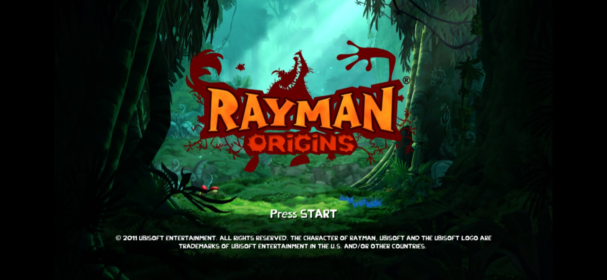
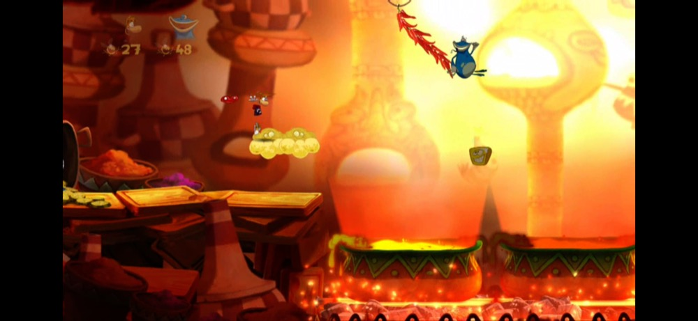

# Building for Android

Status: **the APK builds.** It runs the recompiled game natively on ARM64 with the ReXGlue runtime (kernel, XMA audio, input, files). Graphics still go through ReXGlue's Xenos GPU emulation over Vulkan, which is heavy. The native renderer (docs/PROGRESS.md section 7) replaces it later. The APK has not been run on a device yet.

Target: arm64-v8a, Android 10 (API 29) or newer, Vulkan 1.1. Tested build hosts: macOS on Apple Silicon, Windows 11.

## Requirements

- Android SDK with platform 35, build-tools 35 and **NDK 28.2.13676358** (Android Studio's SDK Manager)
- JDK 17 or newer, CMake ≥ 3.25, Ninja
- The macOS (or Linux) ReXGlue SDK in `tools/rexglue/<host>`, used for codegen on the host
- Your own copy of the game (see the README)

## 1. ReXGlue for Android

ReXGlue has no Android build upstream. `android/rexglue-patches/` holds our patch against v0.10.0:

- CMake platform detection: Android is `UNIX` but has no X11/Wayland, and `APPLE` must not leak from a macOS host before `project()`.
- An `ANativeWindow` surface taken from SDL3, plus an `SDL_main` entry point that sets `HOME` and the default game data folder.
- AArch64 fiber switching (Bionic has no `getcontext`/`swapcontext`). This is required, because every guest thread converts to a fiber.
- Shims for NDK libc++ gaps (floating-point `from_chars`, `clock_cast`, `jthread`) and for Bionic (no robust mutexes).
- The runtime locates its GPU plugin next to its own library (`dladdr`), since `/proc/self/exe` is the zygote.
- Performance (0005, 0006, see [ANDROID_PERFORMANCE.md](ANDROID_PERFORMANCE.md)): guest memory commits use `mprotect` instead of parsing `/proc/self/maps`, and `WaitMultiple` sleeps instead of polling.

```sh
git clone --recurse-submodules --branch v0.10.0 https://github.com/rexglue/rexglue-sdk.git tools/forks/rexglue-src
git -C tools/forks/rexglue-src am ../../../android/rexglue-patches/*.patch
NDK=$HOME/Library/Android/sdk/ndk/28.2.13676358
cmake -S tools/forks/rexglue-src -B tools/forks/rexglue-src/out/android-arm64 -G Ninja \
    -DCMAKE_TOOLCHAIN_FILE=$NDK/build/cmake/android.toolchain.cmake \
    -DANDROID_ABI=arm64-v8a -DANDROID_PLATFORM=android-29 -DANDROID_STL=c++_shared \
    -DCMAKE_BUILD_TYPE=Release -DREXGLUE_ENABLE_TRACY=OFF \
    -DCMAKE_INSTALL_PREFIX=$PWD/tools/forks/rexglue-src/out/install-android-arm64
cmake --build tools/forks/rexglue-src/out/android-arm64
cmake --install tools/forks/rexglue-src/out/android-arm64
```

## 2. The game library

Codegen is the same as on desktop (see the README). Then:

```sh
cd rex
SDK=$PWD/../tools/forks/rexglue-src/out/install-android-arm64
cmake -S . -B out/build/android-arm64 -G Ninja \
    -DCMAKE_TOOLCHAIN_FILE=$NDK/build/cmake/android.toolchain.cmake \
    -DANDROID_ABI=arm64-v8a -DANDROID_PLATFORM=android-29 -DANDROID_STL=c++_shared \
    -DCMAKE_BUILD_TYPE=Release -Drexglue_DIR=$SDK/lib/cmake/rexglue -DCMAKE_FIND_ROOT_PATH=$SDK \
    -DREXGLUE_HOST_TOOL=$PWD/../tools/rexglue/mac-arm64/bin/rexglue
cmake --build out/build/android-arm64
cd ..
```

On Android the game is `librayman.so`. `SDLActivity` loads it and calls `SDL_main`.

## 3. APK

```sh
sh android/build_apk.sh          # android/app/build/outputs/apk/debug/app-debug.apk
```

On a Windows host, run it from Git Bash; for step 2 pass the Windows SDK's `tools/rexglue/win-amd64/bin/rexglue.exe` as `REXGLUE_HOST_TOOL`. Git on Windows checks out the submodules' symlinks as small text files, which breaks the ReXGlue build with errors like `expected identifier` in a file that only contains a path: replace each one with a copy of its target.

## 4. Install and copy your game

**One file to carry:** `python tools/make_game_pack.py` packs your `private/game` into `private/dist/RaymanOrigins-game.zip` (stored, Zip64). Copy it to the device, open the app and tap **Import game pack (.zip)**: it extracts with a progress bar and starts the game. The pack is your copy of the game: keep it to yourself. The game is over 4 GB, so it can't go inside the APK, which is limited to Zip32.

With adb instead:

```sh
G=/sdcard/Android/data/io.github.belmantegu.raymanrecomp/files/game
adb install -r android/app/build/outputs/apk/debug/app-debug.apk
adb shell mkdir -p $G
adb push private/game/. $G/
# Folders created by adb belong to `shell` with mode 770, and the app process
# can't traverse them. Open them up:
adb shell "find $G -type d -exec chmod 777 {} +"
```

The app reads `default.xex` and the bundles from that folder. The runtime log is at `/sdcard/Android/data/io.github.belmantegu.raymanrecomp/files/rayman.log`. Crashes show up in `adb logcat -b crash`.

## Status on a Galaxy S23 (Adreno 740, Android 16)

**The title screen renders.** The native libraries load, the Vulkan device and swapchain come up at 2340×1080, the guest memory is mapped, and audio opens at 6 channels / 48 kHz. The game shows the Ubisoft logo, then the title screen rendered in real time (captured with `adb exec-out screencap`):



Left idle, the game plays its pre-rendered attract video (`rolling_demo.wmv`), so movie playback works too:



Graphics still go through the Xenos emulation, and performance hasn't been measured.

## Also tested: Galaxy A56 (Exynos, not Snapdragon)

The Galaxy A56 (Exynos 1580) has no Adreno GPU: its Samsung **Xclipse 540** is based on AMD's RDNA architecture, with Samsung's own Vulkan driver. The game runs very well on it with nothing specific to it: the first level at **60 fps**, correct picture, and the renderer never waits for the GPU (two frames in flight). It is the first non-Snapdragon phone the port has run on. Details in [ANDROID_PERFORMANCE.md](ANDROID_PERFORMANCE.md#beyond-adreno-galaxy-a56-exynos-1580-xclipse-540).

## Performance

[ANDROID_PERFORMANCE.md](ANDROID_PERFORMANCE.md) has the profiling pass on the Galaxy S23 and the Redmi 10C: what cost the frame rate, how it was measured and what fixed it. Levels went from 43–46 to 60 fps at full resolution. **Settings → Resolution** (50–100%) lowers the render resolution for weaker GPUs.

## Controls

- **On-screen controller.** A floating stick on the left, placed where the thumb lands. A (jump, hold to glide), X (attack), B, Y and RT (run) on the right. Back and Start at the top. The overlay feeds an SDL3 virtual gamepad (`rex/src/android_touch.cpp`), so the game sees an ordinary Xbox 360 controller.
- **Settings** (⚙ at the top right): show or hide the controls, opacity, size, the native renderer, and *fill the whole screen* (only for the emulated GPU: it stretches the 16:9 picture; the native renderer shows true widescreen). **Home screen** opens the launcher (game files, saves, graphics). The ⚙ button stays faintly visible when the controls are hidden.
- **Starting:** the app opens on the home screen ([PORT_HOME.md](PORT_HOME.md)): Play, Options (resolution, graphics, touch controls, imports), Game files (import your game pack) and Quit, driven by touch or a controller. The game is landscape only.
- **Touch behaviour:** a button presses only when a finger lands on it (or slides onto it from another button); a thumb resting between buttons stays inert. The stick has a small dead zone.
- **Physical controllers and keyboards** work through SDL, with the same keyboard bindings as desktop (`--mnk_mode`). Hide the on-screen controls when using one: hiding them also removes the virtual pad.
- **Extra options:** one runtime option per line in `files/args.txt`.

## Next

- First device run (Galaxy S23, Adreno 740). Known risk: other Xbox 360 ports report Adreno 740 driver crashes, and some ship a Turnip driver through libadrenotools.
- Touch controls. Controllers work through SDL.
- The native renderer, which is where performance comes from. [UnleashedRecomp-Android](https://github.com/SansNope/UnleashedRecomp-Android) (GPL-3.0, compatible) already solves plume on Android Vulkan, BC→ETC2 texture transcoding and Adreno driver quirks.
