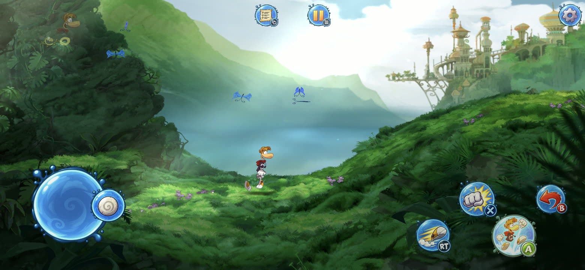

# Android performance: findings and fixes

A profiling pass on the Android port with the native renderer, done on a phone while the game was played. Each finding below was measured before being fixed, and each fix was measured again on the same device.

Devices:

| | GPU | Vulkan | Notes |
|---|---|---|---|
| Galaxy S23 (SM-S911B), Android 16 | Adreno 740 | 1.3 | main test device, 2340×1080, 120 Hz panel run at 60 Hz |
| Redmi 10C (220333QL), Android 13 | Adreno 610 | **1.1** | low-end target: 3.7 GB RAM, 720×1650, 4× A73 + 4× A53 |
| Galaxy A56 (SM-A566E), Android 16 | **Xclipse 540** | 1.3 | Exynos 1580, **not a Snapdragon**: Samsung's AMD RDNA-based GPU; mid-range, 1080×2340 |

## Summary

| # | Finding | Cost before | After |
|---|---|---|---|
| 1 | Swapchain re-created on **every frame** | 47% of the game thread; 43–46 fps in levels | 60 fps at full resolution |
| 2 | Every guest memory commit parsed `/proc/self/maps` | stalls on the world map and level changes | an `mprotect` per commit |
| 3 | `WaitMultiple` polled in a loop | audio worker: 73% of a core | 7% |
| 4 | SDL3 on Android: `SDL_WaitEvent` spun | UI thread: 100% of a core | ~0% |
| 5 | The game kept running behind the lock screen | full load (and heat) while unseen | held until the app is back |
| 6 | Movie planes decoded to RGBA8 texel by texel | 10 ms and 5.4 MB of uploads per frame | decoder 12× faster, uploads ÷4 |
| 7 | Renderer needed Vulkan 1.2 descriptor indexing and 5 sets | did not start on Adreno 6xx (Vulkan 1.1, 4 sets) | runs on plain Vulkan 1.1 |
| 8 | Per-draw CPU work in the renderer | `CopyVertices` alone: 14% of the game thread | only the used vertices and constants |
| 9 | CPU waited for the GPU at the end of every frame | 3–8 ms per frame on the game thread | 2 frames in flight |
| 10 | Pipelines compiled on first use | 50–115 ms hitches on new effects | cache on disk + pre-warm |

The fixes to ReXGlue itself are `android/rexglue-patches/0005` and `0006`. The rest is in this repository.

## How it was measured

- **Frame breakdown** (`rex/src/native_renderer.cpp`): every 120 frames, the fps and where the frame went: *draw hooks* (the renderer's CPU work while the game draws), *end* (recording and submitting), *gpu wait*. Every frame over 20 ms is logged with what it created: new pipelines, new textures, re-uploads, KB uploaded. Read it with `adb logcat -s RaymanNative`.
- **CPU profile per thread and function:** `simpleperf` from the device, on the debuggable build.
  ```sh
  adb shell simpleperf record --app io.github.belmantegu.raymanrecomp -e cpu-clock -f 4000 --duration 8 -o /data/local/tmp/p.data
  adb shell simpleperf report -i /data/local/tmp/p.data --sort comm,symbol
  ```
- **Where a thread waits** (off-CPU time, with call stacks): `--trace-offcpu --call-graph dwarf -t <tid>`. Finding 1 only shows up this way: the time is spent blocked, not computing.
- **Threads:** `adb shell top -H -p <pid>`.

## 1. The swapchain was re-created on every frame

**Symptom.** In levels the game ran at 43–46 fps, and the renderer's own counters (draw hooks + end + gpu wait) added up to only ~7 ms of a 22 ms frame. `top` showed the game thread at about 55% CPU: it was waiting, not computing.

**Finding.** An off-CPU profile of the game thread put 78% of its time inside the game's `Present`, and 47% inside `Renderer::Recreate` → `vkCreateSwapchainKHR` → gralloc buffer allocation (binder IPC to the allocator service).

The swapchain uses the identity pre-transform and lets the compositor rotate the picture to landscape. The display reports a 90° rotation, so Android's `vkQueuePresentKHR` returns `VK_SUBOPTIMAL_KHR` **on every present**. The renderer treated `SUBOPTIMAL` as "stale", so every frame paid a `vkDeviceWaitIdle`, a swapchain destruction and three new 2340×1080 buffers. It was also the source of the stream of `qdgralloc` messages in logcat.

**Fix.** Only `VK_ERROR_OUT_OF_DATE_KHR` and `VK_ERROR_SURFACE_LOST_KHR` re-create the swapchain; a suboptimal swapchain still presents correctly (`tools/native_renderer/vk_renderer.h`). Re-creations are logged now.

**Result.** The same level at full resolution: **43–46 → 60 fps**, stable.

## 2. Every guest allocation parsed `/proc/self/maps`

**Finding.** In the game thread's profile, `std::getline` and `sscanf` stood out. Their caller was `NtAllocateVirtualMemory` → `BaseHeap::AllocFixed` → `rex::memory::AllocFixed`.

The guest address space is reserved at startup, so every commit took this path on Linux/Android:
1. `mmap(MAP_FIXED_NOREPLACE)` over the range, which always fails with `EEXIST` (the reservation is there);
2. `IsRangeFullyMapped`, which reads and parses all of `/proc/self/maps` (3,449 lines, 351 KB for this process). The kernel builds that text with the process's mmap lock held, so page faults in every other thread stall meanwhile;
3. the `mprotect` that does the commit.

`mprotect` already fails with `ENOMEM` unless every page of the range is mapped, so step 2 checked something the kernel checks anyway. The game allocates the most while loading, which is where the stalls were felt: the world map and level changes.

**Fix** (`android/rexglue-patches/0005`). A commit with a base address tries `mprotect` first; the `EEXIST` path no longer parses `/proc/self/maps`.

## 3. `WaitMultiple` polled

**Finding.** The audio worker used 73% of a core. Its profile: `PosixConditionBase::WaitMultiple`, `pthread_mutex_trylock`, atomic compare-and-swaps and `clock_gettime`.

`WaitMultiple` (Windows' `WaitForMultipleObjects`) tried to lock every handle, checked them, slept 1 ms and started over. When a `trylock` failed it yielded and retried **without sleeping or checking the timeout**. The audio worker waits on nine handles this way all the time.

**Fix** (`android/rexglue-patches/0006`). A handle that becomes signaled (event, semaphore release, mutant release, timer, thread exit) bumps a global generation counter and wakes the multi-waiters through one condition variable. That costs one atomic load per signal when nobody is in a multi-wait, which is the common case. Wait-any checks each handle under its own lock; wait-all locks them in address order, so two multi-waits can't deadlock.

**Result.** Audio worker: **73% → 7%** of a core.

## 4. SDL3's `SDL_WaitEvent` spun on Android

**Finding.** The thread running `SDL_main` (the runtime's UI loop, which should sleep in `SDL_WaitEvent`) used 100% of a core, mostly in `clock_gettime`, `sem_post` and `Android_SendLifecycleEvent`.

On Android, `SDL_WaitEventTimeoutNS` pumps events with `push_sentinel = true` on every pass, which pushes a poll sentinel event. Every pushed event sends a wakeup, and on Android a wakeup is a lifecycle event that ends the next `Android_PumpEvents(-1)` at once. The wait wakes itself up forever.

**Fix.** The sentinel only matters to `SDL_PollEvent` loops, so the app turns it off before SDL starts: `SDL_POLL_SENTINEL=0` (`RaymanActivity`). The touch overlay's virtual gamepad produces its events in `SDL_UpdateJoysticks`, on the next pump of that (now sleeping) thread, so it pushes an empty user event to wake it (`rex/src/android_touch.cpp`). Physical controllers and keyboards push their events and wake it already.

**Result.** UI thread: **100% → ~0%**.

With fixes 3 and 4, almost two cores stopped burning. Besides the fps, that matters for heat: during testing the S23 reached thermal status 2 (SoC at 52 °C) and ran its cores well below their maximum clocks.

## 5. The game ran behind the lock screen

**Finding.** With the phone locked, the game kept rendering and decoding its attract movie for minutes. Android keeps the window alive behind the lock screen and the notification shade, and the renderer only paused when the window was destroyed.

**Fix.** An SDL event watch tracks `WILL_ENTER_BACKGROUND` / `DID_ENTER_FOREGROUND`, and `Present` holds the game while the app is in the background (`rex/src/native_renderer.cpp`).

Two crashes found along the way, both fixed:
- **Started behind the lock screen:** there was no window yet, and a null `ANativeWindow` reached `vkCreateAndroidSurfaceKHR`. The runtime's fault handler retried the faulting access forever (100% CPU, no picture). The surface factory now waits for the window.
- **`onPause` before the game ran:** the touch overlay attached its virtual pad through SDL while the runtime's input driver was gone (the game had failed to start), and crashed on a destroyed mutex. The pad now waits for the game's first presented frame.

## 6. Movie textures

**Finding.** During movies (the attract video, cutscenes, loading screens) the renderer spent **10 ms per frame** in its draw hooks, re-uploading three textures per frame: **5.4 MB**. They are the movie's Y/U/V planes (1280×720 and 2 × 640×360, format `k_8`), rewritten by the game every frame.

The decoder:
- expanded one-channel textures to RGBA8 (4× the bytes);
- computed the tiled address (`GetTiledOffset2D`) twice per texel, once for the span and once to decode;
- decoded into a new zero-filled vector, then copied it into the staging buffer.

**Fix** (`tools/native_renderer/xenos_texture.h`, `vk_renderer.h`):
- `k_8` textures are `R8_UNORM` images with an RRRR swizzle on the view: the shader reads the same values from a quarter of the bytes;
- decoding goes straight into the staging buffer;
- the span is an analytic bound;
- within a run of 8 blocks in x, the tiled offset is the run's offset plus a delta that depends on `x & 7` only (the address bits x and y feed don't overlap), so the offset is computed once per run. For `k_8` a run is 8 contiguous bytes, copied at once and byte-swapped within their 32-bit groups.

The new decoder was checked against the old one on 4,000 random cases (formats, sizes, pitches, tiling, packed mips, endianness): identical output.

**Result.** A 1280×720 `k_8` plane decodes in **8.5 → 0.7 ms** (x86 host), and uploads drop from **5.4 to 1.35 MB** per frame.

## 7. Vulkan 1.1 GPUs (Adreno 6xx)

**Finding** (Redmi 10C, Adreno 610, driver 512.502, probed with a small `vulkaninfo`-like tool):
- Vulkan **1.1.128**, without `VK_EXT_descriptor_indexing`;
- **`maxBoundDescriptorSets = 4`**;
- no BC texture compression (ETC2 and ASTC are supported).

The renderer required Vulkan 1.2 descriptor indexing (runtime arrays, partially bound descriptors) and used 5 descriptor sets: XenosRecomp's layout, with one set per heap (2D, 3D, cube, samplers) plus the constants.

**Fix** (`tools/native_renderer/spirv_patch.h`). The SPIR-V is rewritten when it is loaded, so the shaders already built still work:
- unsized heap arrays (`OpTypeRuntimeArray`) become fixed-size arrays (1024 textures, 16 samplers), and the descriptor indexing capabilities, extension and `NonUniform` decorations go (the heap index is uniform per draw: Vulkan 1.0's dynamic indexing covers it);
- the 5 sets are packed into 4: 2D heap, 3D + cube, samplers, constants.

The renderer then asks for Vulkan 1.1 and `shaderSampledImageArrayDynamicIndexing` only, and fills every heap slot with a 1×1 placeholder, since descriptors can't be partially bound. All 35 of the game's shaders pass `spirv-val --target-env vulkan1.1` after the patch.

## 8. Per-draw CPU work in the renderer

The game thread's CPU profile in a level (~130 draws per frame) had the renderer at about 27%:

| Function | Share of the game thread | Cause | Fix |
|---|---|---|---|
| `CopyVertices` | 14% | byte-swapped the **whole** vertex buffer of the fetch constant on every draw; the game shares big buffers between many small draws | only the vertex range the primitive uses; indices rebased to it |
| `FillConstants` | 5% | byte-swapped 2 × 4 KB of constants per draw | only the bytes each shader reads, from its uniform block in the SPIR-V (on average about half of the 4 KB; most pixel shaders read no constants of their own) |
| `@plt` / allocation | ~5% | `std::string` cache keys built with `to_string` on every draw; new vectors per draw; a 32-read content signature per texture per draw | plain struct keys; reused buffers; the signature once per texture per frame |

## 9. Frames in flight

**Finding.** After fix 1, the game thread still spent 3–8 ms per frame waiting on the fence of the frame it had just submitted: one frame in flight, so the CPU and the GPU took turns.

**Fix.** Two frames in flight. Each frame has its own vertex, index, constant and staging buffers, command buffers, fence, semaphores, texture heap set and constant set. `BeginFrame` only waits for the frame that used those resources last, two frames ago.

**Result.** On the Galaxy A56 (Xclipse) and on the Galaxy S23 (Adreno 740) the GPU wait drops to **0.0 ms**: when a frame starts, the frame that used its resources has always finished.

A new texture heap slot is written to the current frame's set right away, and to the other frame's set when that frame comes around. A descriptor set that a pending command buffer may read is never written, and no update-after-bind is needed (the Adreno 610 has none). Per-frame buffers are sized for what a frame uses now that only the used vertices and constants are copied: ~96 MB per frame, 192 MB in total, against 272 MB before for a single frame.

## 10. Pipeline hitches

**Finding.** Frames of 50–115 ms when a new effect or area appeared: pipelines are compiled the first time a combination of shaders, blend state and vertex stride is used, on the game thread.

**Fix.** A `VkPipelineCache` loaded from `files/pipeline_cache.bin`, and the list of pipelines the game has used (`files/pipelines.txt`). All the listed pipelines are created at startup, and both files are saved (at most every 5 s) when new pipelines appear. From the second session on, a known pipeline costs nothing mid-game; a cache from another driver is rejected by the driver and the renderer starts empty.

## Beyond Adreno: Galaxy A56 (Exynos 1580, Xclipse 540)

Up to this pass the port had only run on Snapdragon phones (Adreno GPUs). The Galaxy A56 is an Exynos phone: its GPU, the Samsung Xclipse 540, is based on AMD's RDNA architecture, with Samsung's own Vulkan driver (1.3.279, driver 24.0.560). It is a mid-range phone, well below the S23.

With all the fixes above and nothing specific to it, the game **runs very well** there: the first level at **60 fps**, with the correct picture (widescreen, touch controls).



| Galaxy A56, in a level (~120 draws per frame) | |
|---|---|
| Frame rate | **60 fps** |
| Renderer CPU per frame (draw hooks + end) | 0.5–1.0 ms |
| GPU wait | **0.0 ms**: with two frames in flight the game thread never waits for the GPU |

This is also the first run of fix 9 (two frames in flight) on a device, and of the renderer on a non-Adreno driver.

## Render resolution

**Settings → Resolution** (50–100%, applied on the next frame): the game is drawn at a fraction of the screen size and stretched to it by the final blit. The render targets used by effects follow the same scale.

On the S23, before fix 1: 45 fps at 100%, **57–60 fps at 50–67%**. After fix 1 it holds 60 fps at 100%. The setting is meant for low-end GPUs such as the Adreno 610.

## Still open

- The Redmi 10C (Adreno 610, Vulkan 1.1): the renderer's Vulkan 1.1 path is built for it and its SPIR-V validates, but it hasn't run on the device yet.
- Thermal behaviour over long sessions, and the GPU cost at full resolution on low-end devices.
- Texture decoding for new textures still runs on the game thread (loading screens).
- The rest of the game thread is the recompiled game code itself, spread over thousands of functions, the largest at 1.7%.
