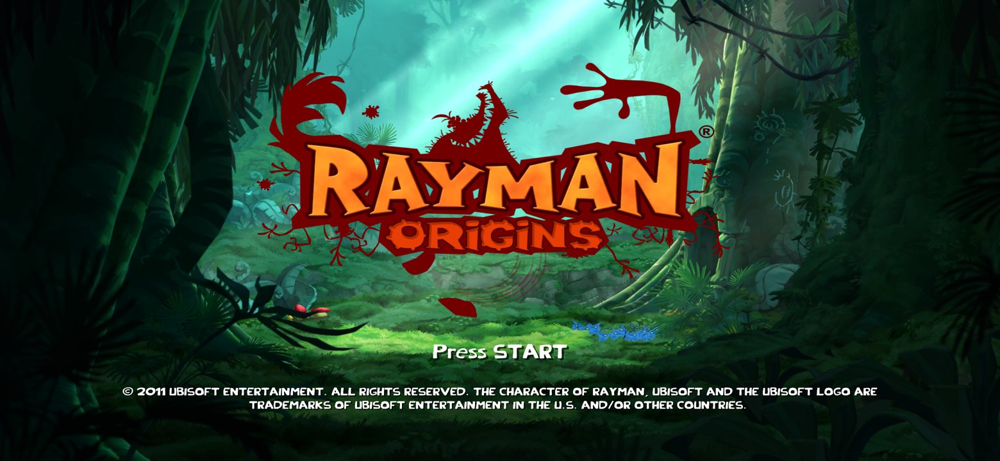

# Native renderer

The game can run **without Xbox 360 GPU emulation**. Its Direct3D draw calls are intercepted at the D3D level and drawn with Vulkan, using the game's own shaders recompiled ahead of time to SPIR-V. It runs on macOS (MoltenVK) and Android.

| | Xenos emulation | Native renderer |
|---|---|---|
| Apple M1, title screen | 30–55 fps, 100–620 ms stalls | **~59 fps**, native window resolution |
| Galaxy S23 (Adreno 740) | slow, stalls | **60 fps**, worst frame ~18 ms |

How the pieces fit is in [D3D_MAP.md](D3D_MAP.md); the investigation is in [PROGRESS.md](PROGRESS.md) section 7.

## How it works

- `rex/src/native_capture.cpp` hooks the game's D3D: `CreateVertexShader`/`CreatePixelShader` (hashes each shader container with XXH3, the key the SPIR-V is named by) and the three draw entry points.
- For each draw, `tools/native_renderer/vk_renderer.h` reads the Xenos register shadow that D3D keeps in its device structure: fetch constants, shader constants and render state. It then copies the vertices and indices (big-endian to little-endian), decodes the textures (`xenos_texture.h`: tiling, packed mips, DXT1/3/5, 8888), picks a pipeline for the shaders and blend state, and draws.
- `rexgpu-null` (ReXGlue plugin, `android/rexglue-patches/0003-0004`) keeps the guest GPU protocol running (ring buffer, fences, interrupts, vblank) without drawing, and leaves the window to the native renderer.

The shaders need no 64-bit integers or buffer device addresses (`hlsl_ubo.py` moves XenosRecomp's constants to uniform buffers), so stock Adreno drivers work.

## Build the SPIR-V shaders (once, from your own game files)

```sh
tools/diag/build.sh && tools/diag/imagedump private/game/default.xex private/data/image.bin
# build tools/forks/xenosrecomp (hedge-dev/XenosRecomp) and tools/native_renderer/shaderprep first
sh tools/native_renderer/build_spirv.sh      # -> private/native/spirv_ubo/<HASH>_{vs,ps}.spv
```

The output is derived from the game: it stays in `private/`.

## Run

- **macOS:** `sh rex/run_native.sh`. Needs `librexgpu-null.dylib` next to the executable (ReXGlue built with the patches).
- **Android:** the native renderer is the default (launcher → *Graphics: Vulkan*). `android/build_apk.sh` packs the shaders from `private/native/spirv_ubo` into your local APK; the launcher extracts them on first run.

### Widescreen

`RAYMAN_WIDESCREEN=<aspect>` (or `auto` for the window's aspect) makes the game frame a wider scene instead of 16:9: it patches UbiArt's two 16:9 fit constants (16/9 at `0x8201EF58`, 9/16 at `0x8201EF5C`, used by `sub_824C8798`) and the renderer fits that aspect into the window. The guest video mode has to match, e.g. on macOS:

```sh
RAYMAN_WIDESCREEN=auto sh rex/run_native.sh --fullscreen=false --window_width=1560 --window_height=720 \
    --video_mode_width=1560 --video_mode_height=720
```



On Android it is on by default with the native renderer: the app sets a 720-line video mode with the display's aspect (19.5:9 on a Galaxy S23).

## Status

The title screen and the gameplay captured so far render correctly. Diagnostics: the renderer logs skipped draws and their reason every 300 frames (`[native] skipped xN: ...`). Movies play (quad lists, 8-bit planes, textures refreshed when their content changes). Known gaps: render-to-texture passes and vertex formats not seen yet.
